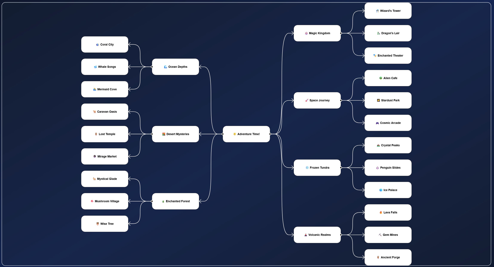

# Mindmapgen
This is what you get when someone with limited Web Development experience and no math background tries to create a Mindmap visualizer. Two tiers supported (one tier for RadialLayout). 

Play around with the showcase: https://marktielemans.github.io/mindmapgen/.



# React
The mindmap component can display data reactively and allows for interaction with the input data as well.
The Mindmap component must be configured with a renderer, such as `JsonView` or `SvgMindmapView`.

The React implementation allows for two-way databinding and live and debounced updates, animation, styling, etc.

## Usage

### SVG Mindmap
```ts
import SvgMindmapView from "@/components/Mindmap/render/SvgMindmapView";

const [Renderer, setRenderer] = useState(() => SvgMindmapView);

return (
    <Mindmap data={data} onDataChange={onDataChange} Renderer={Renderer} renderConfig={{showToolTip: false, showControlBar: false, arrowColor: 'red', arrowCurveExclFactor: 0.8, dimensions: { x: 0, y: 0, w: 0, h: 0 }}} />
);
```

### JSON Dump
```ts
import JsonView from "@/components/Mindmap/render/JsonView";

const [Renderer, setRenderer] = useState(() => JsonView);

return (
    <Mindmap data={data} onDataChange={onDataChange} Renderer={Renderer} />
);
```

# Javascript
Early development version with limited functionality.